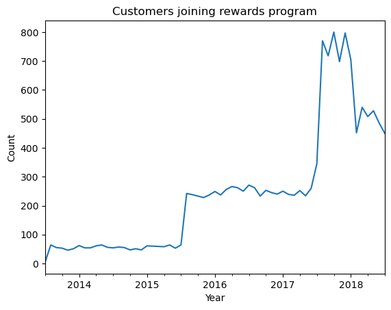

## Project Overview

This is a blog  summary to present my finding for the Starbuck's Capstone Project of the Udacity Data Science Nanodegree.  

All the details of the project are available here [GitHub repository](https://github.com/MarcinTom/udacity_data_science_nano_capstone.git) 
The code and the analysis is available here [Jupyter Notebook](https://github.com/MarcinTom/udacity_data_science_nano_capstone/blob/8a0cdd28e4f1b6d1468952b7f40b1af9e618b81c/Starbucks_Capstone_notebook.ipynb)

## Problem Statement
During the project I focused on answering the below two questions:
1. What are the main drivers of an effective offer on the Starbucks app?
2. Out of the compared models (Decision Tree and Random Forest) which one is better in predicting the correct classifications

## Data
The dataset is contained in three files:
1. portfolio.json - containing offer ids and meta data about each offer (duration, type, etc.)
- id (string) - offer id
- offer_type (string) - type of offer ie BOGO, discount, informational
- difficulty (int) - minimum required spend to complete an offer
- reward (int) - reward given for completing an offer
- duration (int) - time for offer to be open, in days
- channels (list of strings)

2. profile.json - demographic data for each customer
- age (int) - age of the customer
- became_member_on (int) - date when customer created an app account
- gender (str) - gender of the customer (note some entries contain 'O' for other rather than M or F)
- id (str) - customer id
- income (float) - customer's income

3. transcript.json - records for transactions, offers received, offers viewed, and offers completed.
- event (str) - record description (ie transaction, offer received, offer viewed, etc.)
- person (str) - customer id
- time (int) - time in hours since start of test. The data begins at time t=0
- value - (dict of strings) - either an offer id or transaction amount depending on the record

## Data exploration and analysis
I started my analysis with the portfolio dataframe. It has no missing values. Based on id column we can confirm that there are 10 unique offers in dataframe. 

The 3 types of offers are:
- BOGO - buy one get one free
- Discount - discount with purchase
- Informational - provides information about products


I decided to convert channels column list to a separate columns with bool encoding to get more information potentially useful for data modelling.


For demographic data I also checked what is the amount of missing data. The impacted columns where `gender` and `income` with 13% of missing data in total.
Additionally I created an age distribution plot to see how it is distributed between the customers.

The results showed some anomaly for age==118


After checking the missing data in profile dataframe I noticed that these might be some incorrect entries as both gender and income are None, plus age = 118 years. Therefore I decide to drop these lines from dataframe as it's only 13%


Afterwards I focused on the `become_member_on` column. First I applied proper date formatting plus calculate `membership_time` to verify the longest Starbucks loyalty club customers



As visible on the plot the number of customers joining the program increased over time up to `2018` where first, significant drop was visible. There are also two significant spikes in `2015Q2` and `2017Q1`

I performed a further distribution analysis to gather more information about the customers of Starbucks using the app.


The age distribution looks more or less similar between genders. Though there is slight difference in similarity in case of male users, where a significant group of users close to 20 years old is visible. The other two genders have closer to  normal distribution.
Interestingly in terms of income there is a visible right skewed shape on male's graph. Female one looks closer to normal distribution. It seems that men using the app do in general earn less.

For the transcript data set I extracted the additional information available in the `value` column to gather more insight


After conversion the table looked as below:


This allowed me to fill some missing `offer_id` values in some of the rows.

## Data preprocessing

As shown in the data there are 4 types of events: `offer completed`, `offer received`, `offer view`, and `transaction`. However there is not data showing us the transactions itself, therefore we need to establish the methodology that will allow as to identify the offers that ended with success and the ones that did not.

For a `BOGO` and `discount offer`, an effective offer would be defined if the following events were recorded in the right sequence in time:

`offer received -> offer viewed -> transaction -> offer completed`

Meanwhile, for an `informational offer`, since there offer completed event associated with it, I will have to define transactions as a conversion to effective offer:

`offer received -> offer viewed -> transaction`

1. People who are influenced and successfully complete - effective offers:

- `offer received` -> `offer viewed` -> `transaction` -> `offer completed` (BOGO/discount offers)
- `offer received` -> `offer viewed` -> `transaction` (informational offers - must be within validity period of offer)

2. People who received and viewed an offer but did not successfully complete - ineffective offers:

- `offer received` -> `offer viewed`

3. People who purchase/complete offers regardless of awareness of any offers:

- `transaction`
- `offer received` -> `transaction` -> `offer completed` -> `offer viewed`
- `transaction` -> `offer received` -> `offer completed` -> `offer viewed`
- `offer received` -> `transaction` -> `offer viewed` -> `offer completed`
- `offer received` -> `transaction` (informational offers)
- `offer received` -> `transaction` -> `offer viewed` (informational offers)

4. People who received offers but no action taken:

- `offer received`

I sorted the transcript data by `customer_id` and `time` to make sure we have a right sequence of events. I then filled missing values in `offer_id` column for transactions to identify the transactions for specific offers in the next step


I also did a comparison of the types of events per offer type and it showed that most frequent are the BOGO and Discount offers.


As we already identified the right `offer_id` for transactions we just need to make sure that a right sequence of `events` before the transaction occurred. This will lead us to focus mostly on `Group 1` of people who where successfully influenced by the offer.

`Group 2` of people would therefore go to the the ineffective offer area.

What should we do with the people from `Group 3 and 4`? From business perspective they are not important. `Group 3` people do the transactions regardless receiving any offers. `Group 4` do not even view them or make transactions. So these are not groups we should target when sending the offers at all. So we will exclude them in the further part before data modelling.

To identify successful offers we need to make sure that the `offer_id` of transaction is the same as `offer_id` of previous event. Then if we have right sequence of events with the same `offer_id`, this will be a confirmation of the successful offer.

We have to remember that for `BOGO` and `discount` offers the effective offer is the one ended with `offer completed event`. For `informational` offers this will be `transaction` event respectively.

The `Group 1` people from `BOGO` and `discount` datasets can be prepared based on the above rules. For `informational` dataset additional condition has to be taken into consideration. The transactions have to occurred within the validity period of an offer to recognize this as effective offer.

The above allowed me to prepare the right dataframe to start modelling. I decide to split it into 3 separate datasets based on `offer_type` to get  better suited models.

## Data modelling
As there are 3 data frames I will create 3 separate models to forecast the target feature which is `offer_responded`. The models will be supervised binary classification ones. I will create a simple decision tree classifier and use it as a benchmark to enhanced model. Before modelling I checked if the datasets are balanced.

```
                 customer_id
offer_responded             
0                    0.17783
1                    0.82217
                 customer_id
offer_responded             
0                   0.135256
1                   0.864744
                 customer_id
offer_responded             
0                   0.252318
1                   0.747682
```

There is a visible difference between classes in all three datasets, therefore we can use F1 score as an evaluation metric. It provides better performance measurement in such situations. F1 score gives more weight to true positive and hence for the Starbucks app here, it would be fine as we would priorities more on whether offers are effective, and less focus on why offers are ineffective.

I compared the performance of two types of classifiers Decision Tree and Random Forest for all 3 types of data sets. For all types of offers the Random forest model achieved better results both in in sample and out of sample verification.

For BOGO offers the results were as below

Decision tree model
```
DecisionTreeClassifier(max_depth=20, random_state=42)
Train sample report
              precision    recall  f1-score   support

           0     0.9703    0.9252    0.9472      1551
           1     0.9837    0.9938    0.9887      7049

    accuracy                         0.9814      8600
   macro avg     0.9770    0.9595    0.9680      8600
weighted avg     0.9813    0.9814    0.9812      8600

Test sample report
              precision    recall  f1-score   support

           0     0.2901    0.3139    0.3015       634
           1     0.8550    0.8405    0.8477      3053

    accuracy                         0.7499      3687
   macro avg     0.5726    0.5772    0.5746      3687
weighted avg     0.7579    0.7499    0.7538      3687

Training F1 score:    0.9887085391672547
Test F1 score:  0.8477039973571191
```

Random forest model
```
RandomForestClassifier(max_depth=20, random_state=42)
Train sample report
              precision    recall  f1-score   support

           0     1.0000    0.9955    0.9977      1551
           1     0.9990    1.0000    0.9995      7049

    accuracy                         0.9992      8600
   macro avg     0.9995    0.9977    0.9986      8600
weighted avg     0.9992    0.9992    0.9992      8600

Test sample report
              precision    recall  f1-score   support

           0     0.3705    0.1782    0.2407       634
           1     0.8459    0.9371    0.8892      3053

    accuracy                         0.8066      3687
   macro avg     0.6082    0.5577    0.5649      3687
weighted avg     0.7642    0.8066    0.7777      3687

Training F1 score:    0.9995037220843672
Test F1 score:  0.8891996891996892
```

For Discount offers the results were as below

Decision tree model
```
DecisionTreeClassifier(max_depth=20, random_state=42)
Train sample report
              precision    recall  f1-score   support

           0     0.9680    0.9150    0.9408      1224
           1     0.9866    0.9952    0.9909      7682

    accuracy                         0.9842      8906
   macro avg     0.9773    0.9551    0.9658      8906
weighted avg     0.9840    0.9842    0.9840      8906

Test sample report
              precision    recall  f1-score   support

           0     0.2954    0.3340    0.3135       497
           1     0.8983    0.8808    0.8895      3321

    accuracy                         0.8096      3818
   macro avg     0.5969    0.6074    0.6015      3818
weighted avg     0.8199    0.8096    0.8145      3818

Training F1 score:    0.9908625494135183
Test F1 score:  0.8894632811312149
```

Random forest model
```
RandomForestClassifier(max_depth=20, random_state=42)
Train sample report
              precision    recall  f1-score   support

           0     1.0000    0.9918    0.9959      1224
           1     0.9987    1.0000    0.9993      7682

    accuracy                         0.9989      8906
   macro avg     0.9993    0.9959    0.9976      8906
weighted avg     0.9989    0.9989    0.9989      8906

Test sample report
              precision    recall  f1-score   support

           0     0.3735    0.1247    0.1870       497
           1     0.8809    0.9687    0.9227      3321

    accuracy                         0.8588      3818
   macro avg     0.6272    0.5467    0.5549      3818
weighted avg     0.8148    0.8588    0.8269      3818

Training F1 score:    0.9993495511903213
Test F1 score:  0.9227018499928294
```

For Informal offers the results were as below

Decision tree model
```
DecisionTreeClassifier(max_depth=20, random_state=42)
Train sample report
              precision    recall  f1-score   support

           0     0.9781    0.9356    0.9564      1289
           1     0.9783    0.9928    0.9855      3768

    accuracy                         0.9782      5057
   macro avg     0.9782    0.9642    0.9709      5057
weighted avg     0.9782    0.9782    0.9781      5057

Test sample report
              precision    recall  f1-score   support

           0     0.3520    0.3876    0.3690       534
           1     0.7930    0.7668    0.7797      1634

    accuracy                         0.6734      2168
   macro avg     0.5725    0.5772    0.5743      2168
weighted avg     0.6844    0.6734    0.6785      2168

Training F1 score:    0.9855110642781875
Test F1 score:  0.7797137523335407
```

Random forest model
```
DecisionTreeClassifier(max_depth=20, random_state=42)
Train sample report
              precision    recall  f1-score   support

           0     0.9781    0.9356    0.9564      1289
           1     0.9783    0.9928    0.9855      3768

    accuracy                         0.9782      5057
   macro avg     0.9782    0.9642    0.9709      5057
weighted avg     0.9782    0.9782    0.9781      5057

Test sample report
              precision    recall  f1-score   support

           0     0.3520    0.3876    0.3690       534
           1     0.7930    0.7668    0.7797      1634

    accuracy                         0.6734      2168
   macro avg     0.5725    0.5772    0.5743      2168
weighted avg     0.6844    0.6734    0.6785      2168

Training F1 score:    0.9855110642781875
Test F1 score:  0.7797137523335407
```

For the feature importance in all 3 types of offers we had similar results pointing to the membership time as the most important feature in the model. Income and age where also important variables in  this comparison


### Project conclusions

The goal of the project was to predict customer positive response on the Starbucks offer based on all available information. I created a simple classification model using Decision Tree classifier. Then compared it to the results of the Random Forest performance. The latter was better in all all 3 types of offers. I also verified the feature importance to check which variables do influence the target variable in most significant way.

The most relevant factors for offer success based on the model are:
1. Membership time
2. Income
3. Age


### Potential future improvement:
- Explore other classification models types
- Apply hyper parameter tuning
- Add additional variables with feature engineering
